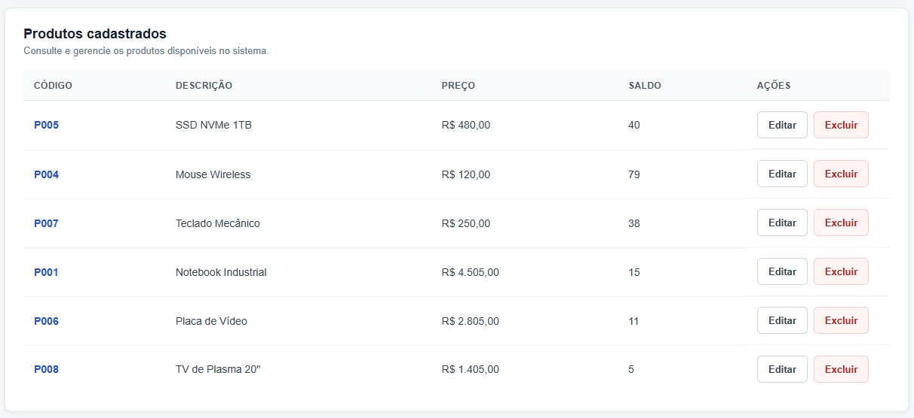
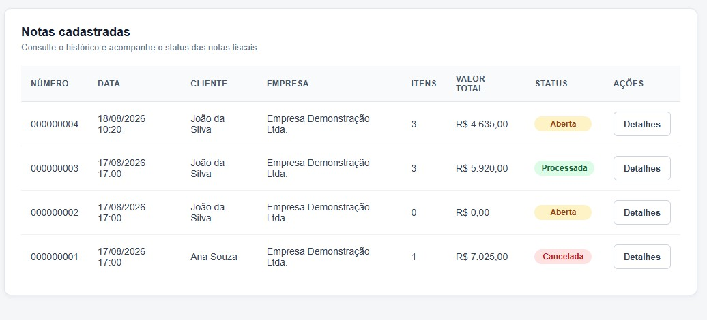
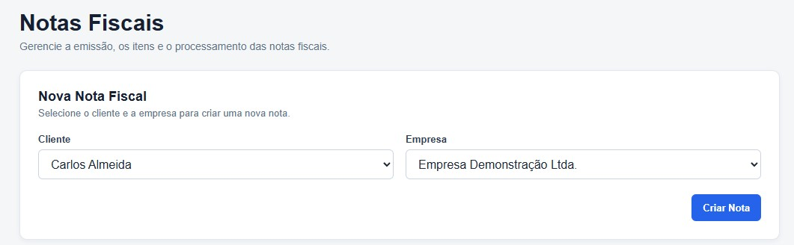
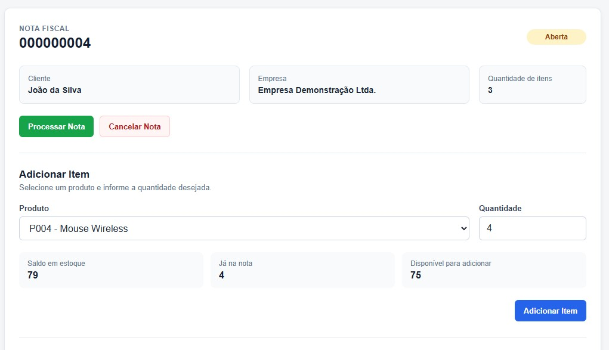

# Industrial ERP

Sistema web desenvolvido como desafio técnico, simulando funcionalidades de um ERP industrial para gerenciamento de produtos, controle de estoque e emissão de notas fiscais.

O projeto utiliza uma arquitetura baseada em serviços independentes, com **Angular** no frontend, **ASP.NET Core** no backend e **PostgreSQL** para persistência dos dados.

## Sobre o projeto

O **Industrial ERP** foi desenvolvido com o objetivo de demonstrar a implementação de um fluxo integrado entre cadastro de produtos, controle de estoque e emissão de notas fiscais.

A solução foi dividida em dois backends independentes:

- **Produtos e Estoque** — responsável pelo cadastro de produtos, consulta de saldo e movimentações de estoque.
- **Notas Fiscais** — responsável pela criação e gerenciamento das notas fiscais, clientes, empresas e itens da nota.

O frontend desenvolvido em Angular consome as APIs REST disponibilizadas pelos dois serviços.

## Funcionalidades

### Produtos

- Listagem de produtos
- Cadastro de novos produtos
- Edição de produtos
- Exclusão lógica (soft delete)
- Controle de produtos ativos

### Estoque

- Consulta de saldo por produto
- Baixa de estoque
- Estorno de estoque
- Registro das movimentações
- Validação para impedir saldo negativo
- Prevenção de movimentações duplicadas

### Notas Fiscais

- Listagem de notas fiscais
- Criação de notas fiscais
- Numeração sequencial
- Seleção de cliente e empresa
- Inclusão de produtos na nota
- Consulta de saldo durante a inclusão dos produtos
- Processamento da nota com baixa de estoque
- Cancelamento de notas
- Estorno de estoque ao cancelar uma nota processada

## Regras de negócio

As notas fiscais podem possuir os seguintes status:

- **Aberta**
- **Processada**
- **Cancelada**

Uma nova nota fiscal é criada com o status **Aberta**.

Enquanto estiver aberta, a nota pode ser alterada e seus itens podem ser gerenciados.

Ao processar uma nota:

1. O saldo dos produtos é validado.
2. As movimentações de estoque são realizadas.
3. O estoque dos produtos é atualizado.
4. A nota passa para o status **Processada**.

Não é permitido realizar uma baixa que resulte em saldo negativo.

O cancelamento depende do estado atual da nota:

- **Nota Aberta:** é apenas alterada para `Cancelada`, sem movimentação de estoque.
- **Nota Processada:** as movimentações realizadas anteriormente são estornadas e a nota passa para `Cancelada`.

Notas canceladas ou processadas não podem ser editadas.

As movimentações de estoque possuem uma referência que permite identificar a operação de origem e evitar movimentações duplicadas.

## Arquitetura

A aplicação foi dividida em três projetos principais:

```text
Angular Frontend
       |
       | HTTP / REST
       |
       +-----------------------+
       |                       |
       v                       v
Backend Produtos        Backend Notas
ASP.NET Core            ASP.NET Core
       |                       |
       v                       v
PostgreSQL              PostgreSQL
Produtos/Estoque        Notas Fiscais
```

O backend de produtos é responsável exclusivamente pelo domínio de produtos e estoque.

O backend de notas fiscais mantém apenas o `ProdutoId` nos itens da nota, evitando relacionamento direto de banco de dados entre serviços.

A comunicação entre os domínios ocorre através das APIs.

## Tecnologias utilizadas

### Frontend

- Angular
- TypeScript
- RxJS
- HTML
- CSS

### Backend

- C#
- ASP.NET Core
- Entity Framework Core
- REST APIs
- OpenAPI

### Banco de dados

- PostgreSQL
- Entity Framework Core Migrations

### Ferramentas

- Visual Studio Code
- Git
- GitHub
- Postman
- pgAdmin 4

## Estrutura do projeto

```text
industrial-erp/
│
├── backend-produtos/
│   ├── Controllers/
│   ├── Data/
│   ├── DTOs/
│   ├── Models/
│   ├── Migrations/
│   └── Program.cs
│
├── backend-notas/
│   ├── Controllers/
│   ├── Data/
│   ├── DTOs/
│   ├── Models/
│   ├── Migrations/
│   └── Program.cs
│
├── frontend/
│   └── src/
│       └── app/
│           ├── components/
│           ├── models/
│           └── services/
│
└── README.md
```

## Executando o projeto

### Pré-requisitos

Para executar o projeto localmente é necessário possuir:

- .NET SDK
- Node.js
- Angular CLI
- PostgreSQL

### Banco de dados

O projeto utiliza dois bancos PostgreSQL independentes:

```text
Produtos / Estoque
Notas Fiscais
```

Configure as respectivas connection strings nos arquivos de configuração dos backends.

Após configurar os bancos, execute as migrations do Entity Framework Core em cada backend.

```bash
dotnet ef database update
```

> As credenciais e connection strings locais não devem ser versionadas no repositório.

### Backend de Produtos

Acesse o diretório:

```bash
cd backend-produtos
```

Execute:

```bash
dotnet restore
dotnet run
```

Por padrão, durante o desenvolvimento, a API é executada em:

```text
http://localhost:5019
```

### Backend de Notas Fiscais

Acesse o diretório:

```bash
cd backend-notas
```

Execute:

```bash
dotnet restore
dotnet run
```

Por padrão, durante o desenvolvimento, a API é executada em:

```text
http://localhost:5150
```

### Frontend Angular

Acesse o diretório do frontend:

```bash
cd frontend
```

Instale as dependências:

```bash
npm install
```

Execute a aplicação:

```bash
ng serve
```

A aplicação estará disponível em:

```text
http://localhost:4200
```

## Endpoints da API

### Produtos

```http
GET    /api/Produtos
POST   /api/Produtos
PUT    /api/Produtos/{id}
GET    /api/Produtos/{id}
DELETE /api/Produtos/{id}
```

### Estoque

```http
GET  /api/Estoque/{produtoId}
POST /api/Estoque/baixa
POST /api/Estoque/estorno
```

### Clientes

```http
GET /api/Clientes
```

### Empresas

```http
GET /api/Empresas
```

### Notas Fiscais

```http
GET    /api/Notas
GET    /api/Notas/{id}
POST   /api/Notas
POST   /api/Notas/{id}/itens
PUT    /api/Notas/{notaId}/itens/{itemId}
DELETE /api/Notas/{notaId}/itens/{itemId}
POST   /api/Notas/{id}/processar
POST   /api/Notas/{id}/cancelar
```

A documentação detalhada dos endpoints, incluindo parâmetros, request bodies e modelos de resposta, está disponível através da especificação **OpenAPI** ao executar os backends.

**Backend de Produtos:**
`http://localhost:5019/openapi/v1.json`

**Backend de Notas Fiscais:**
`http://localhost:5150/openapi/v1.json`

## Screenshots

### Produtos



### Notas Fiscais



### Criação de Nota Fiscal



### Controle de Estoque



## Decisões técnicas

### Separação dos backends

Produtos/estoque e notas fiscais foram separados em serviços independentes para reduzir o acoplamento entre os domínios e demonstrar uma arquitetura preparada para evolução independente.

Cada serviço possui seu próprio banco de dados.

### Referência de produtos nas notas

O serviço de notas fiscais armazena apenas o identificador (`ProdutoId`) do produto.

Não existe chave estrangeira entre os bancos dos serviços, preservando a independência entre os domínios.

### Soft delete de produtos

Produtos não são removidos fisicamente do banco de dados.

A exclusão altera o estado do produto para inativo, preservando referências históricas.

### Movimentações de estoque

As alterações de estoque são registradas como movimentações.

Essa abordagem permite manter histórico das operações e possibilita realizar estornos de forma controlada.

### Prevenção de duplicidade

As movimentações possuem uma referência da operação responsável pela alteração do estoque.

Essa referência é utilizada para impedir que uma mesma operação gere movimentações duplicadas.

### Validação de saldo com RxJS

No frontend, RxJS é utilizado para controlar a consulta de saldo durante a seleção dos produtos, reduzindo chamadas desnecessárias à API e permitindo validar a disponibilidade antes do processamento da nota.

## Detalhamento técnico

Esta seção apresenta os principais aspectos técnicos da solução, conforme solicitado na especificação do desafio.

### Ciclo de vida do Angular

Foi utilizado o ciclo de vida `OnInit`, por meio da implementação da interface `OnInit` e do método `ngOnInit()`.

O `ngOnInit()` é utilizado para realizar as inicializações necessárias após a criação dos componentes, como o carregamento inicial de produtos, clientes, empresas e notas fiscais.

Na tela de notas fiscais, também é utilizado para configurar a inscrição no fluxo RxJS responsável pela consulta e validação do saldo do produto selecionado.

### Uso de RxJS

Foi utilizado **RxJS** no frontend para tratar de forma reativa a seleção de produtos e a consulta de saldo em estoque.

A seleção do produto é enviada para um fluxo reativo utilizando `Subject`, que posteriormente utiliza operadores como:

- `debounceTime`: evita consultas imediatas em sequência;
- `distinctUntilChanged`: evita repetir a consulta quando o produto selecionado não foi alterado;
- `switchMap`: realiza a consulta de saldo e substitui uma requisição anterior caso uma nova seleção seja realizada.

Após o retorno da API, o saldo disponível é utilizado para validar a quantidade informada antes da inclusão do item na nota.

### Bibliotecas utilizadas

No frontend foram utilizados principalmente os recursos do próprio ecossistema Angular:

- **Angular Forms**: utilizado nos formulários e no data binding através de `ngModel`;
- **Angular Router**: utilizado para navegação entre as telas da aplicação;
- **Angular HttpClient**: utilizado para comunicação com os microsserviços através das APIs REST;
- **RxJS**: utilizado nos fluxos reativos, principalmente na validação de estoque;
- **Angular Common**: utilizado para recursos como `CurrencyPipe` e `DatePipe`.

No backend foram utilizados:

- **ASP.NET Core**: desenvolvimento das APIs REST;
- **Entity Framework Core**: ORM utilizado para persistência e acesso aos dados;
- **Npgsql Entity Framework Core Provider**: integração do Entity Framework Core com PostgreSQL.

### Componentes visuais

Não foi utilizada uma biblioteca externa de componentes visuais.

A interface foi construída utilizando **HTML e CSS**, juntamente com os recursos de template e componentes do próprio Angular.

Essa decisão foi tomada para manter a solução leve e evitar dependências adicionais que não fossem necessárias para o escopo do projeto.

### Frameworks utilizados no C#

O backend foi desenvolvido utilizando **ASP.NET Core**, com APIs REST separadas em dois serviços:

- serviço de produtos e estoque;
- serviço de notas fiscais.

Para persistência dos dados foi utilizado **Entity Framework Core**, juntamente com migrations para criação e evolução da estrutura dos bancos PostgreSQL.

A separação dos serviços mantém as responsabilidades de estoque e faturamento independentes, evitando acesso direto ao banco de dados de outro serviço.

### Tratamento de erros e exceções no backend

O backend realiza validações antes da execução das principais operações e utiliza respostas HTTP adequadas para indicar o resultado das requisições.

Entre os cenários tratados estão:

- recurso não encontrado;
- tentativa de realizar operações inválidas de acordo com o status da nota;
- tentativa de processar nota sem itens;
- saldo insuficiente em estoque;
- prevenção de saldo negativo;
- prevenção de movimentações duplicadas;
- falhas de comunicação entre os serviços.

Os controllers retornam respostas HTTP de acordo com cada situação, como `NotFound`, `BadRequest`, `NoContent` e respostas de sucesso.

No frontend, erros nas chamadas HTTP são tratados nas inscrições dos `Observable`, permitindo registrar a falha e impedir que a interface considere uma operação malsucedida como concluída.

### Uso de LINQ

Foi utilizado **LINQ** no backend para consultas e manipulação dos dados através do Entity Framework Core.

Um exemplo é a listagem de produtos ativos:

```csharp
var produtos = await _context.Produtos
    .Where(p => p.Ativo)
    .ToListAsync();
```

Nesse caso, o `Where` é utilizado para filtrar somente os produtos ativos antes da consulta ser executada no banco de dados.

LINQ também é utilizado em outras consultas da aplicação para localizar, filtrar e validar informações armazenadas através do Entity Framework Core.

### Gerenciamento de dependências

Como a solução foi desenvolvida utilizando C# em vez de Golang, o item de gerenciamento de dependências do Golang não se aplica.

No backend, as dependências .NET são gerenciadas através do **NuGet** e dos arquivos `.csproj`.

No frontend, as dependências são gerenciadas através do **npm**, com as versões e pacotes do projeto definidos no arquivo `package.json`.

## Melhorias futuras

Algumas melhorias que poderiam ser implementadas em uma evolução do projeto:

- Autenticação e autorização de usuários
- Controle de acesso baseado em perfis
- CRUD completo de clientes e empresas
- Histórico detalhado das notas fiscais
- Paginação e filtros nas listagens
- Testes unitários e testes de integração
- Tratamento global de exceções
- Logs estruturados
- Dockerização dos serviços
- Docker Compose para execução completa do ambiente
- Documentação completa das APIs
- CI/CD
- Monitoramento e observabilidade
- Interface responsiva
- Dashboard com indicadores de estoque e faturamento

---

Projeto desenvolvido como parte de um desafio técnico para demonstrar conhecimentos em **Angular, ASP.NET Core, PostgreSQL, APIs REST, arquitetura de software e regras de negócio aplicadas a sistemas ERP**.
